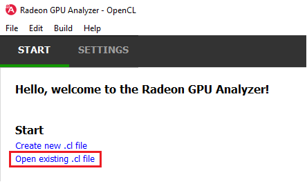
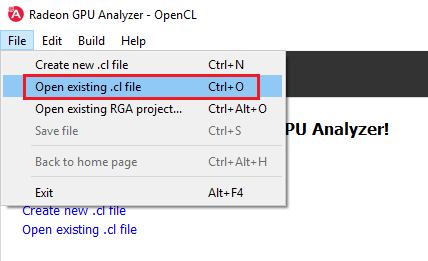
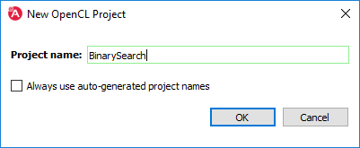
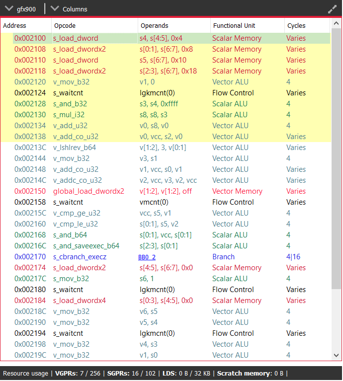
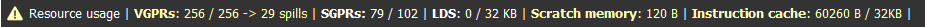

.. Radeon GPU Analyzer Quickstart

Quickstart
==========

Running RGA
-----------
The RGA app is a pure offline compiler without any dependency on the installed hardware or driver. To run the app, run the RadeonGPUAnalyzerGUI executable.

Creating a Project
------------------
RGA Project is a vehicle that can contain any number of OpenCL™ source files (.cl), together with a set of build settings.
When you build the project, the OpenCL™ source files are being compiled and linked together into a single HSA Code Object binary.

RGA will automatically create for you the project when you add or create a file in the Home Page.

To add an existing .cl source file, use Ctrl+O or click on "Open existing .cl file" under the Start section:

You can also do this by clicking on File -> "Open existing c.l file":

In a similar way, you can create a project by creating an empty .cl file. Use the Ctrl+N shortcut or click on "Create new .cl file".

You will then be prompted for an optional rename of your project:

RGA will use a yyyymmdd-hhmmss date-time string as a default name. Check the "Always use auto-generated project names" check box to instruct RGA to always use the default name without prompting for renaming.

Generating Disassembly 
----------------------
To build your project and generate the disassembly, use the Ctrl+Shift+B shortcut.
Alternatively, you can use the Build -> Build project menu item:

.. image:: images/003_build_project.png
  :width: 4.25532in
  :height: 1.82522in
  
When a build is triggered, the rga command line tool will be invoked.
The "Build output" window at the bottom will display the invocation command for the RGA command line tool, as well its output.

In case of a build success, the list of kernels in each file would be shown underneath each entry in the file menu on the left side.

Use that list to control which kernel is in focus (highlighted in yellow):

.. image:: images/005_project_file_menu.png
  :width: 2.45532in
  :height: 0.6in

The disassembly for the relevant kernel will be displayed in the disassembly view on the right:

* Highlighted rows are correlated to the current line in the source code view on the left
* Memory instructions are colored in red to help you identify spots with high memory pressure
* The Columns drop-down menu at the top can be used to customize the presented columns
* If more than one GPU was targeted, use the drop-down on the top left corner to switch devices
* The resource usage line shows the GPU resources that are consumed by the presented code

In case of a performance hazard due to the usage of a GPU resource, RGA will display a warning icon and highlight the relevant resources:

  
The possible hazards are:

	* VGPR spills
	* SGPR spills
	* LDS usage exceeds the recommended limit (based on the target GPU's HW features)
	* Scratch memory usage is non-zero
	* The size of the code is larger than the instruction cache