.. _disassembly_view:

Disassembly View
================

Navigation and Controls
^^^^^^^^^^^^^^^^^^^^^^^

The ISA disassembly is displayed for a single shader stage or compute kernel at a time using the same color coding scheme and tree structure.

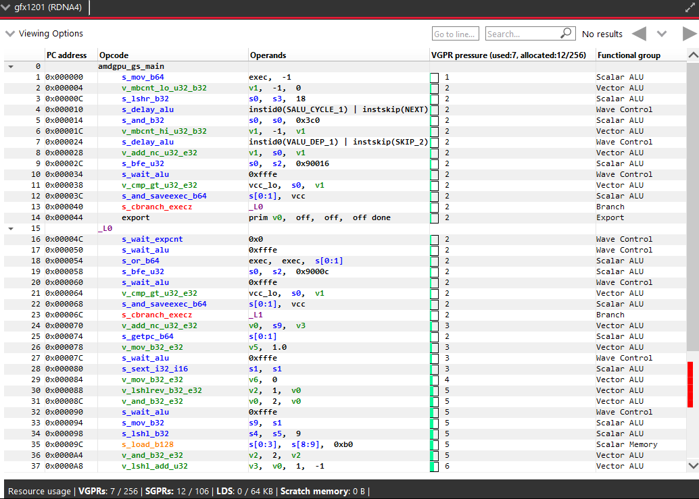

If more than one GPU was targeted, use the drop-down on the top left corner of the disassembly view to switch between devices.

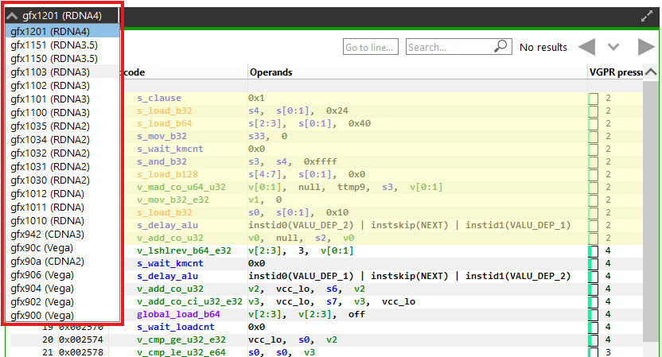

Columns can be customized by using the Viewing Options dropdown to show or hide them.

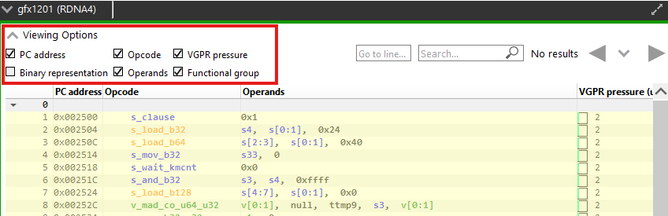

Basic blocks can be expanded and collapsed individually or all at once.
To expand or collapse a single block, click on the arrow on the left side of the instruction line. 
To expand or collapse all blocks in a shader at once, use the (Ctrl + Right) or (Ctrl + Left) shortcut, respectively.

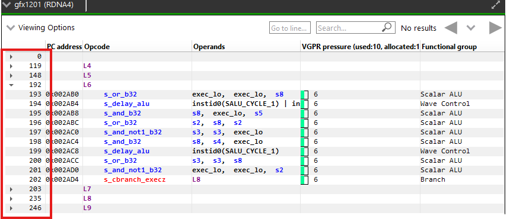

Tokens can be selected and highlighted to see other instances of the selected token (instruction opcodes, registers and constants).

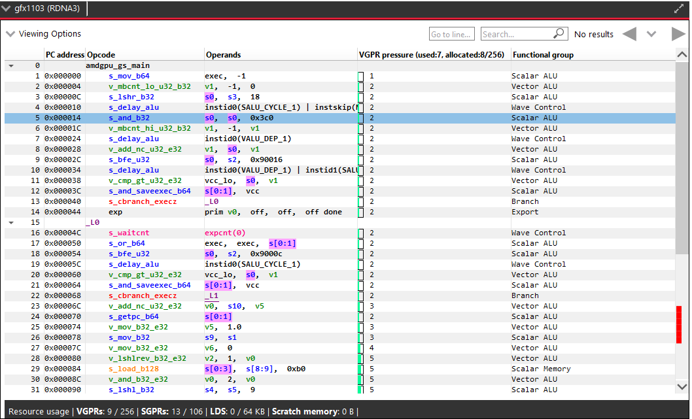

Basic blocks referenced by a branch instruction can be clicked to scroll to the branch instruction.
Similarly, the block referenced in the branch instruction can be clicked to scroll to the block.
Branch navigations are recorded and can be replayed using the navigation history.

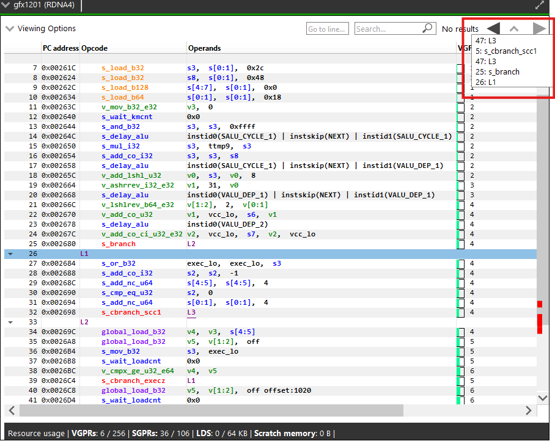

Text in any column can be searched for and the developer can navigate directly to a specific line using the controls displayed below.

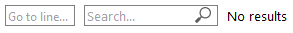

Both the Search command (Ctrl + F) and the Go to line command (Ctrl + G) can be invoked using keyboard shortcuts.

Instruction lines that match the search results are highlighted. 
The vertical scroll bar will also indicate the location of all matches, giving you a visual indicator of where in the shader the various matches can be found.

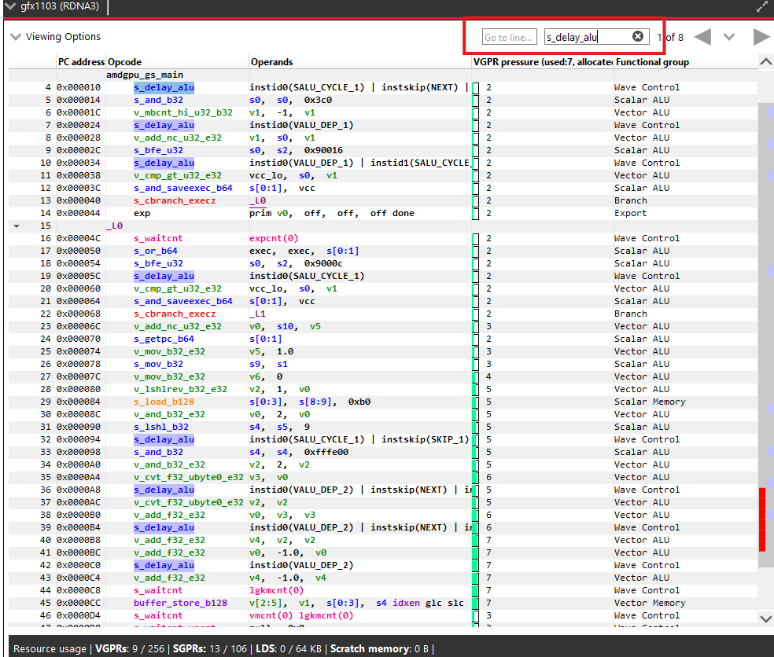

Hovering the mouse over opcodes will show a tooltip with the opcode's explanation, after a short delay.

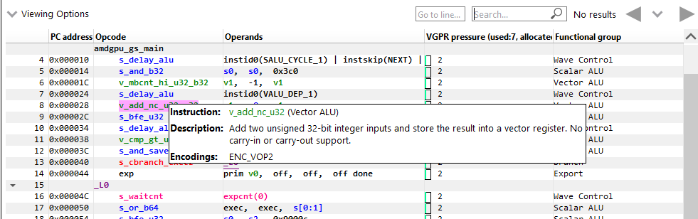

Right clicking on the disassembly view and clicking on "Show disassembly file in explorer" opens current build artifacts.

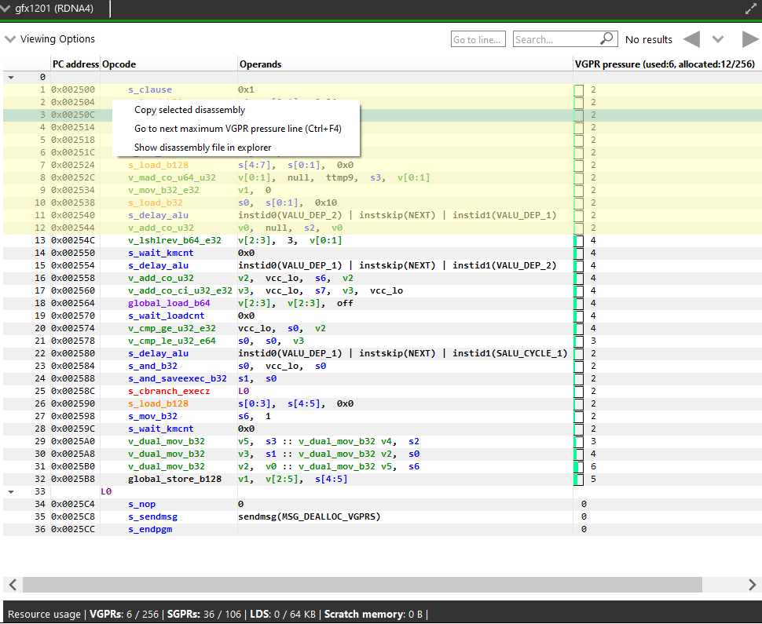

Right clicking on the disassembly view and clicking on "Copy selected disassembly" copies selected disassembly lines.

VGPR Pressure Visualization
^^^^^^^^^^^^^^^^^^^^^^^^^^^

After successfully building your code, you will notice a new column in the disassembly view named “VGPR pressure”.
This column is shown by default and can be hidden using the "Viewing Options" dropdown.

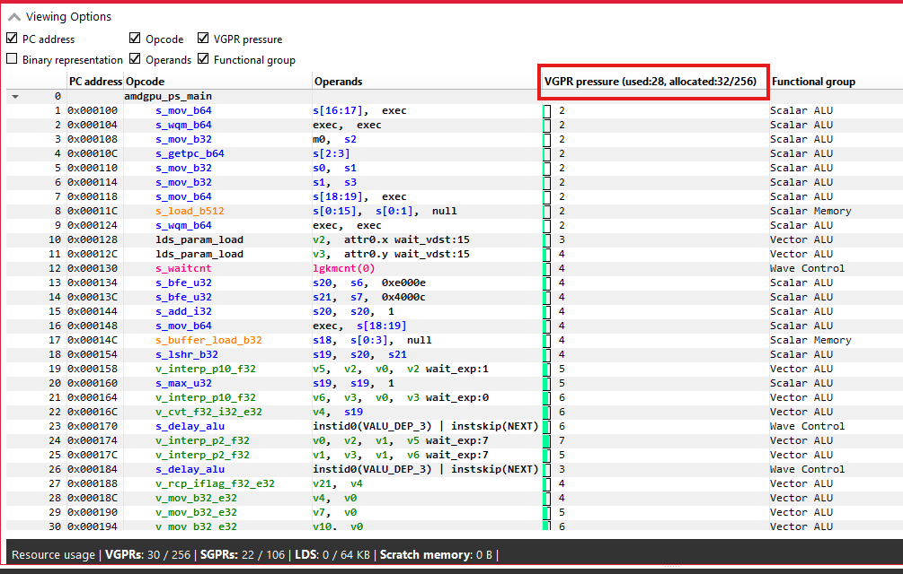

The column header text format is “VGPR pressure (used x; allocated: y/256)”, which provides a summary for the entire shader, where ‘x’ gives the total VGPRs used by the current shader and ‘y’ gives the total number of VGPRs allocated.
Hovering over any of the column’s cells, will show a tooltip with a summary of the live VGPR at that specific instruction, with a hint about how many VGPRs need to be reduced to save a VGPR block at that instruction.
Note that VGPRs are allocated in blocks, which vary in size. The VGPR block size is determined by the target GPU and, in certain cases, by specific characteristics of the shader, such as the wave size it was compiled for. The hint indicates how many VGPRs need to be freed to free up an entire block of VGPRs at that point of the shader:

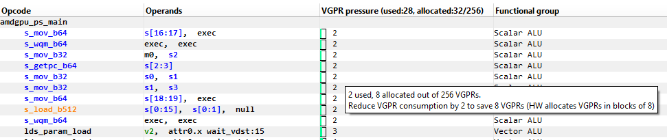

Note that, when generating the hint, the tool will take into account the target GPU and the relevant shader characteristics for determining the VGPR allocation block size for you.
When examining the VGPR pressure column cells, in addition to the numerical value, which gives the number of live VGPRs at that instruction, you would notice a utilization bar that visualizes the VGPR usage and the VGPR block utilization. The emptier the utilization bar is, the less of the allocated VGPR block is being utilized, which means that less VGPRs would need to be reduced to free up that block:

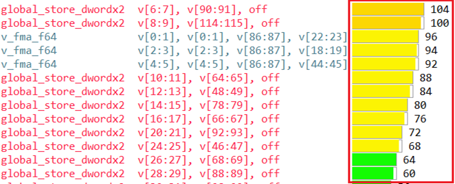

In the above screenshot, we have a shader with a VGPR allocation block size of 8 VGPRs. You can see that different lines have different colors
in their visualization bar. The bar’s color would be greener as the live VGPR value at that instruction gets closer to 0 and redder as the value
gets closer to 256. The lines where the visualization bar is full (where the VGPR usage value is a multiple of 8, like 104, 96, 88 etc.)
show points in the shader where the VGPR allocation block is fully utilized. However, in lines where the bar is partially empty, not all allocated VGPRs
are being used. The tooltip hint that we mentioned earlier will let you know how many VGPRs need to be reduced to free up that VGPR allocation block.

If the register pressure details of any instruction could not be generated, there will be a red hazard symbol as shown in the image below.
The instructions that could not be parsed will have "N/A" in the VGPR pressure column.
Hovering over the hazard symbol provides the count of instructions that could not be parsed in the form of a tooltip.

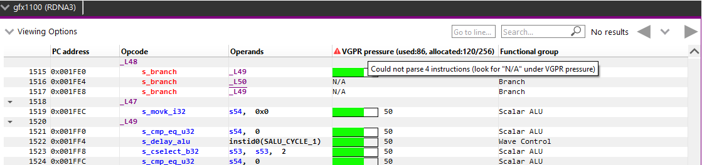

In case the number of VGPRs used hits the max on any instruction, there will be a yellow hazard symbol as shown in the image below.

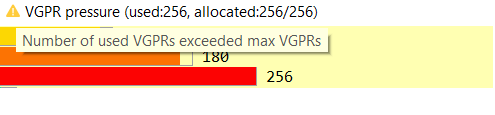

As mentioned earlier, a visualization bar’s color would be greener as the live VGPR value at that instruction gets closer to 0 and redder as the value gets closer to 256.
To calculate the color for each instruction's visualization bar, we break down the 0-256 VGPR range into 8 ranges, each of which covers 32 VGPRs (0-32, 32-64 etc.).
Each range is assigned a unique color starting with light green for the first range to dark red for the last range. Below is a screenshot showing various color ranges:

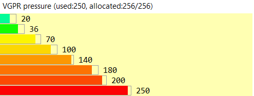

You can cycle through all the lines which have maximum VGPR pressure by pressing the
F4 function key, or from the application's Edit menu by selecting the
"Go to next maximum VGPR pressure line" item, or by pressing the Ctrl+F4 shortcut.
The lines will be highlighted as shown in the image below.

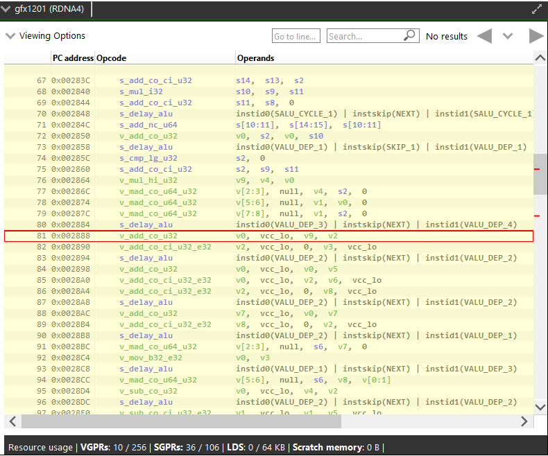

Selecting the "Go to next maximum VGPR pressure line" option in the disassembly view's
context menu also allows you to cycle through maximum live VGPR pressure lines. This option
is shown in the image below.

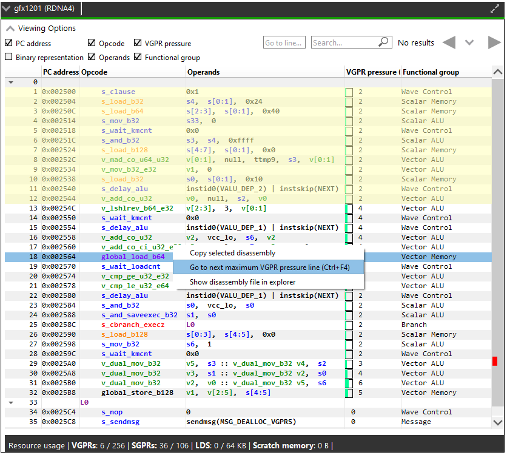

Switching between kernels will reset the feature, and you will have to use one of the
options mentioned above to see the maximum live VGPR pressure lines again.
At this point the first maximum VGPR line for the current kernel will be highlighted.
If the "VGPR pressure" column is currently hidden, pressing the F4 or Ctrl+F4 keys will
have no effect, and the Edit menu item to show this feature will also be disabled.

Pressing the Shift+F4 key combination shows the matches in the reverse order.

The vertical scroll bar will also indicate all the lines which have maximum VGPR pressure, giving you a visual indicator of where the shader could be optimized.

Resource Usage
^^^^^^^^^^^^^^

The resource usage section under the disassembly table shows the GPU resources that are consumed by the ISA. The information found in the view is displayed as follows:

	* VGPR consumption: <used>/<available>
	* SGPR consumption: <used>/<available>
	* VGPR spills (if occurred, otherwise - not shown)
	* SGPR spills (if occurred, otherwise - not shown)
	* LDS consumption: <used>/<available>
	* Scratch memory usage
	* Instruction cache usage

In cases where performance hazards are detected due to the usage of a GPU resource, RGA will display a warning icon and highlight the relevant resources in yellow:

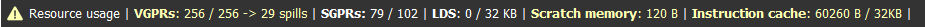

Resource hazards that may require the developer's attention are defined as:

	* VGPR/SGPR hazard: there were register spills, or, <used> == <available>.
	* LDS hazard: <used> == <available> in LDS.
	* Scratch memory hazard: scratch memory is used.
	* Instruction cache hazard: code size is larger than the instruction cache.
